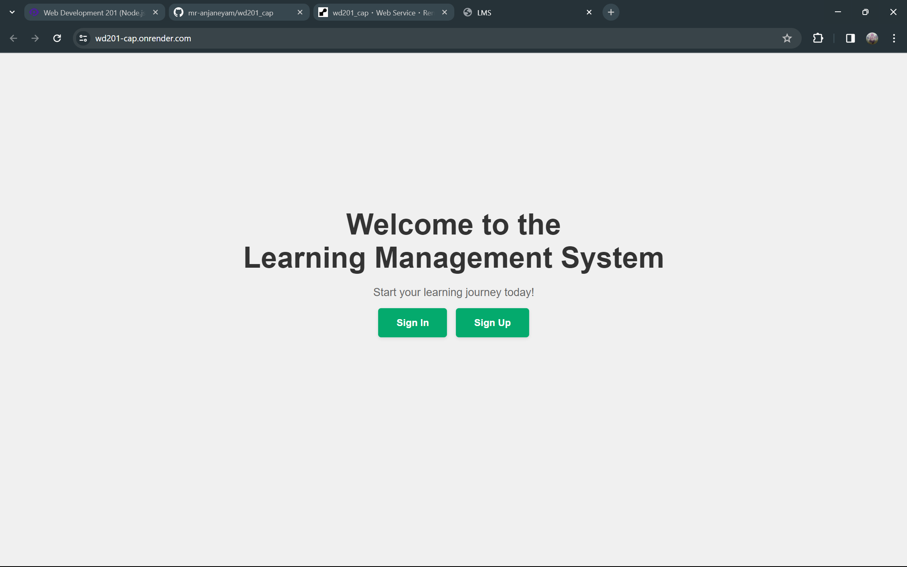

# Learning Management System (LMS) 


<br>
This project is a Learning Management System (LMS) designed to facilitate online courses, chapters, and user management.

## Table of Contents

- [Learning Management System (LMS) Project](#learning-management-system-lms-project)
  - [Table of Contents](#table-of-contents)
  - [Description](#description)
  - [Features](#features)
  - [Getting Started](#getting-started)
    - [Prerequisites](#prerequisites)
    - [Installation](#installation)
  - [Usage](#usage)
  - [Contributing](#contributing)
  - [License](#license)

## Description

The Learning Management System (LMS) Project is a web-based application that provides features for creating courses, managing chapters within each course, and tracking user enrollment and progress. It is designed to streamline the administration and delivery of online education.

## Features

- Course creation and management
- Chapter creation and association with courses
- User registration and enrollment in courses
- User progress tracking
- ...

## Getting Started

Instructions on setting up and running your LMS project locally.

### Prerequisites

- Node.js and npm installed
- PostgreSQL database

### Installation

1. Clone the repository
   ```bash
   git clone <repository-url>
2. Install Dependencies
   ```bash
   cd wd201_cap
   npm install
3. Setup the database
   ```bash
   npx sequelize-cli db:migrate
4. Start the server
   ```bash
   npm start

### Usage

Explain how to use the Learning Management system, including creating courses, adding chapters, and enrolling users.

### Contributing

If you would like to contribute to the development of the LMS project, please follow the <a href="#">contribution guidelines.</a>

### License

This project is licensed under the License.

<i> Feel free to customize the contents based on the specific details of your project. If there are additional features, dependencies, or guidelines for contributing, include them in the appropriate sections. </i>
